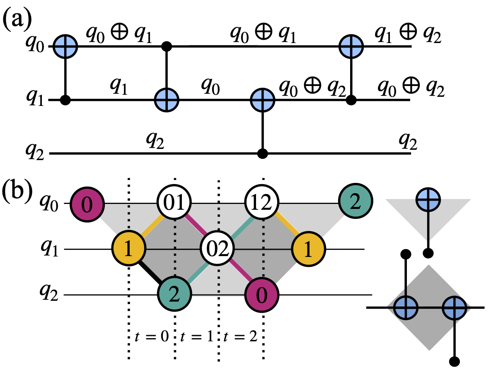

# Optimizing QAOA circuit transpilation with parity twine and SWAP network encodings
Mapping quantum approximate optimization algorithm (QAOA) circuits with non-trivial connectivity in fixed-layout quantum platforms such as superconducting-based quantum processing units (QPUs) requires a process of transpilation to match the quantum circuit on the given layout. This step is critical for reducing error rates when running on noisy QPUs. Two methodologies that improve the resource required to do such transpilation are the SWAP network and parity twine chains (PTC). These approaches reduce the two-qubit gate count and depth needed to represent fully connected circuits. In this work, a simulated annealing-based method is introduced that reduces the PTC and SWAP network encoding requirements in QAOA circuits with non-fully connected two-qubit gates. This method is benchmarked against various transpilers and demonstrates that, beyond specific connectivity thresholds, it achieves significant reductions in both two-qubit gate count and circuit depth, surpassing the performance of Qiskit’s transpiler at its highest optimization level. For example, for a 120-qubit QAOA instance with 25\% connectivity, our method achieves an 85\% reduction in depth and a 28\% reduction in two-qubit gates. Finally, the practical impact of PTC encoding is validated by benchmarking QAOA on the \texttt{ibm\_fez} device, showing improved performance up to 20 qubits, compared to a 15-qubit limit when using SWAP networks.

# QAOA-Efficient-Circuit-Transpilation

Optimizing Quantum Approximate Optimization Algorithm (QAOA) circuit transpilation using parity twine encodings and SWAP network strategies tailored for fixed-layout quantum processors.


---

## 🧠 Overview

Mapping QAOA circuits onto quantum hardware with limited qubit connectivity, such as superconducting-based quantum processing units (QPUs), necessitates efficient transpilation techniques. This project introduces and implements two strategies:

- **Parity Twine Chains (PTC):** The [PTC method](https://parityqc.com/parity-twine-quantum-algorithm-synthesis-reaching-world-record-efficiency) is a generalization of [temporal parity encoding](https://arxiv.org/abs/2408.10907). In this approach, CNOT gates are employed to encode the information of multiple logical qubits onto a single physical qubit. This enables the execution of multi-qubit operations locally, by operating on a single physical qubit. Fig.(a) shows the circuit used to generate parities among all the qubits in a 3-qubit system. Where \(q_0=\alpha_0|0\rangle + \nu_0 |1\rangle\) and \(|0\rangle \oplus |0\rangle = |0\rangle\), \(|0\rangle \oplus |1\rangle = |1\rangle\), \(|1\rangle \oplus |0\rangle = |1\rangle\), and \(|1\rangle \oplus |1\rangle = |0\rangle\). First, a CNOT gate between physical qubits 1 and 0 generates the parity $q_0 \oplus q_1$ in physical qubit 0. The parity $q_0 \oplus q_2$ in physical qubit 1 is then created by performing CNOT gates on qubit pairs (0, 1) and (2, 1). Finally, the parity $q_1 \oplus q_2$ in physical qubit 0 is created by applying a CNOT gate between qubits 1 and 0. The key advantage of this method arises when applying two-qubit operations such as the ZZ interaction, which can now be implemented locally as a single-qubit RZ rotation on the qubit encoding the corresponding parity.

- **SWAP Network Encodings:** The SWAP network strategy is a technique used to overcome the limited qubit connectivity in quantum hardware by systematically inserting swap layers to ensure all-to-all connectivity on a linear chain. The optimal SWAP network for \( N_q \) qubits has been proven to require \( N_q-2 \) total swap layers to achieve all-to-all connected two-qubit gates.
In the case of QAOA, the two-qubit gate count, $N_g$, and depth, $d$, grow as $N_{g} = \frac{3}{2}N_q^2 -\frac{5}{2}N_q + 1$ and $d = 3N_q - 2$.

---

## 📂 Repository Structure

- `PTC_utils.py`: Implements the Parity Twine Compilation strategy.
- `SWAP_utils.py`: Contains functions for SWAP network encoding.
- `simulated_annealing.py`: Provides a simulated annealing optimizer for circuit parameter tuning.
- `utils.py`: Auxiliary functions supporting the main modules.
- `example_transpilation.ipynb`: Demonstrates the transpilation process using the provided strategies.
- `example_real_device.ipynb`: Applies the transpilation techniques to real quantum hardware scenarios.
- `requirements.txt`: Lists the Python dependencies required to run the project.

---

## 🚀 Getting Started

### Prerequisites

Ensure you have Python 3.11 installed. You can create a virtual environment using:

```bash
python3.11 -m venv qaoa_env
source qaoa_env/bin/activate  # On Windows: qaoa_env\Scripts\activate


